# THE HUNT

> **Minor Skilled Final Report — Damyan Peychev**  
> Saxion University of Applied Sciences · Creative Media and Game Technology · 2025–2026

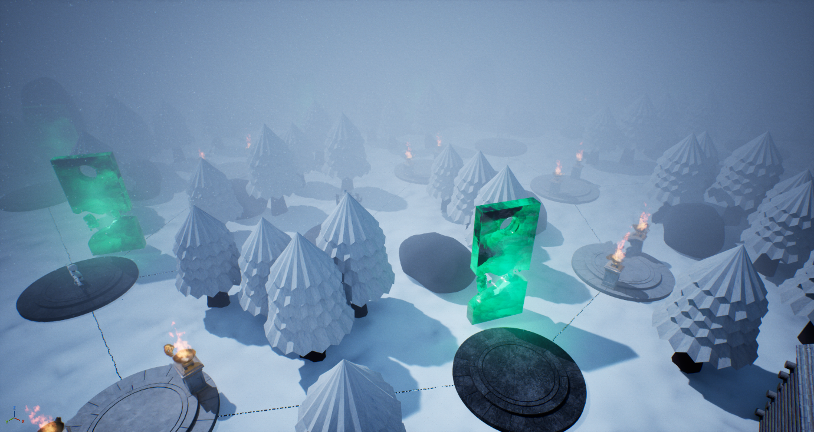

## Table of Contents

- [1. Introduction](#1-introduction)
- [2. Learning Goals](#2-learning-goals)
  - [2.1 Unreal C++ Gameplay Programming (LG1)](#21-unreal-c-gameplay-programming-lg1)
  - [2.2 Modular System Architecture (LG2)](#22-modular-system-architecture-lg2)
  - [2.3 Persistent World & Progression (LG3)](#23-persistent-world-progression-lg3)
  - [2.4 Technical Collaboration & Integration (LG4)](#24-technical-collaboration-integration-lg4)
  - [2.5 Modular Combat System with Integrated Animations (LG5)](#25-modular-combat-system-with-integrated-animations-lg5)
- [3. Discover](#3-discover)
  - [3.1 Understanding Unreal Engine's Architecture](#31-understanding-unreal-engines-architecture)
  - [3.2 Identifying Core Technical Requirements](#32-identifying-core-technical-requirements)
  - [3.3 Researching the Gameplay Ability System](#33-researching-the-gameplay-ability-system)
  - [3.4 Researching the StateTree AI System](#34-researching-the-statetree-ai-system)
  - [3.5 Researching Procedural Map Generation](#35-researching-procedural-map-generation)
  - [3.6 Outcome of the Discover Phase](#36-outcome-of-the-discover-phase)
- [4. Define](#4-define)
  - [4.1 System Architecture](#41-system-architecture)
  - [4.3 Development Roadmap and Planning](#43-development-roadmap-and-planning)
- [5. Develop](#5-develop)
  - [5.1 First Quartal – Foundations](#51-first-quartal-foundations)
  - [5.1.1 Player Movement and Interaction](#511-player-movement-and-interaction)
  - [5.1.2 Inventory Foundation](#512-inventory-foundation)
  - [5.1.3 Items and Item Definitions](#513-items-and-item-definitions)
  - [5.1.4 First QA Session](#514-first-qa-session)
  - [5.1.5 Challenges](#515-challenges)
  - [5.2 Second Quartal – Enemy AI and Combat Foundations](#52-second-quartal-enemy-ai-and-combat-foundations)
  - [5.2.1 Hand-Coded Enemy State Machine](#521-hand-coded-enemy-state-machine)
  - [5.2.2 Combat Foundations: Attributes, Attacking, Blocking, and Stagger](#522-combat-foundations-attributes-attacking-blocking-and-stagger)
  - [5.2.3 Inverse Kinematics Weapon System](#523-inverse-kinematics-weapon-system)
  - [5.2.4 Combat Feedback, Dash and HUD](#524-combat-feedback-dash-and-hud)
  - [5.2.5 Second QA Session](#525-second-qa-session)
  - [5.2.6 Challenges](#526-challenges)
  - [5.3 Third Quartal – Major Reworks](#53-third-quartal-major-reworks)
  - [5.3.1 Enemy AI Rebuilt on StateTree](#531-enemy-ai-rebuilt-on-statetree)
  - [5.3.2 Weapon Runes](#532-weapon-runes)
  - [5.3.3 Inventory, Perks and UI Rework](#533-inventory-perks-and-ui-rework)
  - [5.3.4 Third QA Session](#534-third-qa-session)
  - [5.3.5 Challenges](#535-challenges)
  - [5.4 Fourth Quartal – Map, Events, and Polishing](#54-fourth-quartal-map-events-and-polishing)
  - [5.4.1 Third-Person Player Rework](#541-third-person-player-rework)
  - [5.4.2 Per-Weapon Animation Data](#542-per-weapon-animation-data)
  - [5.4.3 Procedural STS Map](#543-procedural-sts-map)
  - [5.4.4 Progression and Saving](#544-progression-and-saving)
  - [5.4.5 Map Events](#545-map-events)
  - [5.4.6 Sound and VFX](#546-sound-and-vfx)
  - [5.4.7 Final QA Session](#547-final-qa-session)
  - [5.4.8 Challenges](#548-challenges)
- [6. Deliver](#6-deliver)
  - [6.1 Video and Build](#61-video-and-build)
  - [6.2 Reflection](#62-reflection)
- [7. Final Reflection and Conclusion](#7-final-reflection-and-conclusion)
  - [7.1 Planning](#71-planning)
  - [7.2 The Final Product](#72-the-final-product)
  - [7.4 What I Would Do Differently](#74-what-i-would-do-differently)
  - [7.5 Final Words](#75-final-words)
- [8. Asset Credits](#8-asset-credits)
- [9. References](#9-references)
- [10. Appenidx](#10-appenidx)

---

THE HUNT

Minor Skilled Final Report

Damyan Peychev

Saxion University of Applied Sciences

Creative Media and Game Technology

2025–2026

# Table of Contents

# 1. Introduction

This report documents the process, decisions, and outcomes of my Minor Skilled project at Saxion University of Applied Sciences.

The project I chose is a vertical slice of a game idea called “The Hunt.” It is a third-person horror roguelike built in Unreal Engine 5 (UE5) using C++ and UE5’s Blueprints for visual scripting. The game combines Soulslike combat mechanics with a procedural STS-style board structure. This board is inspired by Slay the Spire. The game features event-based encounter systems and other roguelike elements. I will be working in a team of two: I handle all code and integration, while my teammate covers art, design, and level design.

My motivation for this project was specific. Before this minor, I worked primarily in Unity. Unreal Engine was unfamiliar to me, and I wanted to change that by confronting its hardest aspects—real-time combat, AI, procedural systems, and modular architecture—immediately, rather than easing in through tutorial-style exercises.

This report follows the Double Diamond structure defined by the Minor Skilled programme: Discover, Define, Develop, and Deliver (Design Council, 2005). In practice, I moved through these phases iteratively. Each major feature had its own research and definition loop before development.

[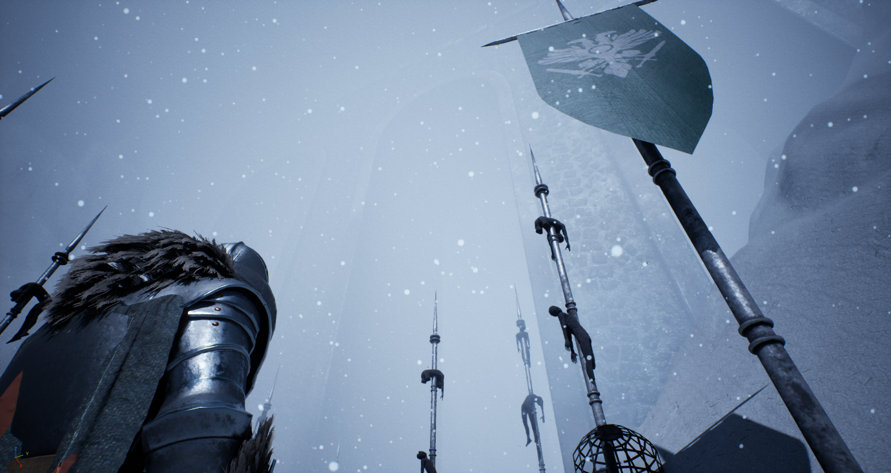](images/image1.png)
*Figure : Image from one of the maps in the game*

# 2. Learning Goals

At the start of the minor, I defined five learning goals to guide my work. These goals focused on gaps between my current skill level and where I aimed to be as a professional game engineer.

## 2.1 Unreal C++ Gameplay Programming (LG1)

My first learning goal was to develop practical fluency in Unreal Engine 5 at the C++ level. I wanted to implement gameplay mechanics, combat systems, and interactive features in C++. This meant relying less on Blueprints. I needed to learn the engine's Gameplay Framework, use UE5's reflection and serialisation systems, and build features that work with engine tools. Success meant I could create complex gameplay systems from scratch in C++ and make informed choices about using the engine or custom systems.

## 2.2 Modular System Architecture (LG2)

My second learning goal was to design and build modular, extensible game systems. This meant making deliberate architectural decisions. I separated concerns across class hierarchy, used data assets for configuration, and built systems meant for reuse and extension. Many junior developers can build mechanics but struggle with making those systems maintainable at scale. I wanted to focus on these decisions throughout the project, not treat architecture as an afterthought.

## 2.3 Persistent World & Progression (LG3)

My third learning goal was to implement systems that persist across play sessions and level transitions: inventory state, run progression, and map state. This required understanding Unreal's Game Instance lifecycle, level streaming, and how to architect data storage that survives actor destruction.

## 2.4 Technical Collaboration & Integration (LG4)

My fourth learning goal was to work effectively as the sole engineer on a two-person team, integrating my technical systems with my teammate's art and design work. This meant drawing clear boundaries between C++ and Blueprint, clearly communicating system interfaces so my teammate could configure and extend them without engineering knowledge, and managing version control for a project with large binary assets. I wanted to come away from this minor with experience of the kind of cross-disciplinary collaboration that is standard in professional game development.

## 2.5 Modular Combat System with Integrated Animations (LG5)

My fifth learning goal was to build a combat system that felt responsive and physically grounded. Animations, collision, sound, and logic needed to be tightly integrated. Combat should clearly communicate to the player through visual and auditory feedback. I aimed to implement animation-driven hitbox activation with notifies, directional hit reactions, weapon-specific sounds, and camera effects such as shake and lock-on offset. The Soulslike genre demands precise hit timing, parry windows, and stagger. Players expect these features.

# 3. Discover

## 3.1 Understanding Unreal Engine's Architecture

My first priority was understanding how Unreal Engine structures a game at the programming level. My previous mental model of objects, components, and scene management was Unity-centric. Unreal is different: Actors, Pawns, Characters, Controllers, GameModes, and GameInstances each have specific roles. The engine is opinionated about how they interact.

I spent the first week reading Epic Games' official documentation on the Gameplay Framework (Epic Games, n.d.-a). I also used Tom Looman's Unreal C++ Programming Guide (Looman, n.d.). The main shift was seeing that Unreal enforces separation between game logic and objects. For example, a PlayerController is a standalone actor that persists, even if the character it controls does not.

## 3.2 Identifying Core Technical Requirements

Once I had a working mental model of Unreal's architecture, I mapped the game's design requirements to engine systems. From the design brief, I extracted the following list of general systems I would need to build or learn:

A third-person player controller with movement, sprint, stamina, and lock-on

A Soulslike combat system with hit detection, parry windows, dodge frames, and stagger

An enemy AI using perception, patrol, investigation, and combat behaviours

A procedurally generated roguelike board with multiple branching paths

A data-driven inventory, item definition, and rune system

A status effect system built on Unreal's Gameplay Ability System (GAS)

A UI event system for in-run encounters (tool usage, stranger trades, push-your-luck events)

I prioritised these by dependency: combat needed a player controller, and AI relied on combat being partly done. The board generator was separate and could be researched in parallel.

## 3.3 Researching the Gameplay Ability System

Choosing Unreal's Gameplay Ability System (GAS) was a key architectural decision made during Discover. GAS is a built-in framework for managing abilities, attributes, effects, and tags in a data-driven way (Epic Games, n.d.-b). It is powerful but notoriously hard to set up. Its documentation is also fragmented.

I researched GAS using Epic's documentation, community resources, and open-source examples. The core concepts I needed were Ability System Components (ASC), Gameplay Attributes, Gameplay Effects (GEs), and Gameplay Tags. GAS allowed combat states like attacking, blocking, parrying, and staggering to be represented as tags. It also lets damage and status effects work as Gameplay Effects, with no direct link between attacker and target.

## 3.4 Researching the StateTree AI System

My first priority for enemy AI was understanding how state machines work conceptually and how to implement one in C++. At this stage, I was aiming to write as much of the game in C++ as possible, so rather than reaching for an engine solution immediately, I researched the theory behind hierarchical state machines — how states transition, how to represent behaviours as discrete nodes, and how to manage shared world state across them (Nystrom, 2014). This led me to design a custom C++ state machine for the enemy AI. In parallel, I researched Unreal's built-in options — Behaviour Trees and the newer StateTree system (Epic Games, n.d.-c) — to understand how they compared, research that proved relevant later when the custom system was revisited after QA feedback.

[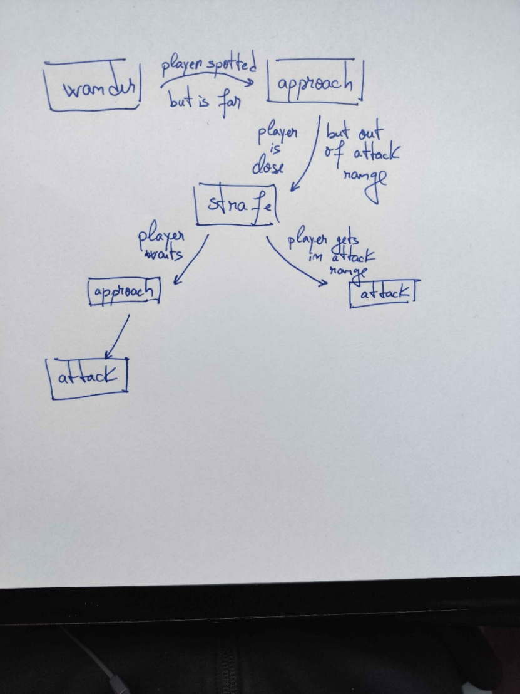](images/image2.jpeg)
*Figure : Rougly mapped out enemy AI state tree*

## 3.5 Researching Procedural Map Generation

The roguelike board was the most algorithmically novel part of the project, and I had no prior experience with, so its research was more exploratory than the others. I started by analysing reference games — primarily Slay the Spire (Mega Crit, 2019), whose map structure is close to what The Hunt needed: nodes across vertical layers, connected by branching paths that converge and diverge. This led to a key insight: the board is fundamentally a graph problem, not a spatial one — the challenge is producing the right connectivity, not placing rooms in space. This reframing led me to a three-stage pipeline: Poisson disk sampling to distribute nodes with a natural, non-grid spread (Lague, 2018); Delaunay triangulation via Unreal's FDelaunay2 class to generate candidate connections; and A* pathfinding with weighted edges to carve five branching paths from top to bottom, using penalties on used edges to encourage divergence and shared junctions.

[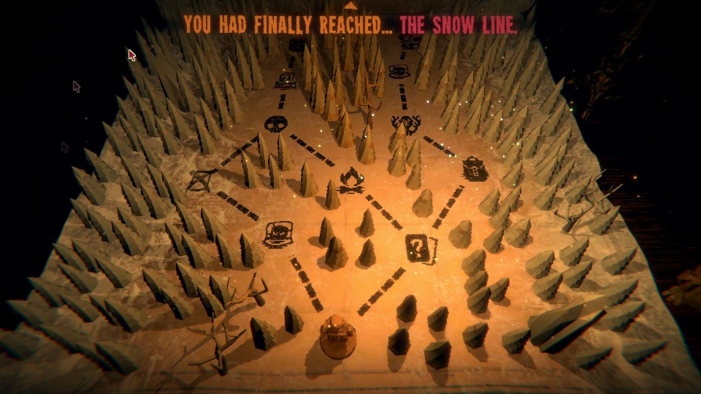](images/image3.png)
*Figure : Slay the Spire STS Map*

## 3.6 Outcome of the Discover Phase

By the end of the Discover phase, I had a clear understanding of the technical landscape. The most important outcomes were the decision to use GAS for combat and status effects, the design of a custom C++ state machine for enemy AI, and the algorithmic design of the board generation pipeline. Each of these decisions shaped the architecture in ways that would have been expensive to reverse later.

# 4. Define

## 4.1 System Architecture

The most important architectural decision made during Define was the separation of concerns across the class hierarchy. Rather than building player-specific logic directly into the player class, I designed ABaseCharacter — a base class containing all systems shared between players and enemies: the Ability System Component, attribute set, weapon attachment, death handling, and footstep audio. APlayerCharacter and the enemy classes inherit from this, adding only their own input handling and specialised behaviour.

This proved highly valuable: when I implemented hit reactions, stagger, or sound playback, I did so once in ABaseCharacter, and all derived classes inherited it immediately. It also meant AMeleeWeapon could be built against the base character interface rather than duplicated per character type.

I applied the same principle across the project. All interactable objects derive from a common AInteractable base defining a shared interaction contract, so adding a new interactable requires only a new subclass. The same pattern recurs in the UItemDefinition data asset hierarchy, in the URuneBase class, which exposes a single OnHit hook, and in StateTree tasks built on shared bases. The guiding principle throughout was to keep systems modular and decoupled: they communicate through events, gameplay tags, and data assets rather than direct references — combat applies effects through GAS without knowing the target's type, and configuration lives in data assets so my teammate could tune weapons, items, and enemies without touching code. The aim was that adding new content later on would slot into the existing framework rather than require changes to it (LG2).

[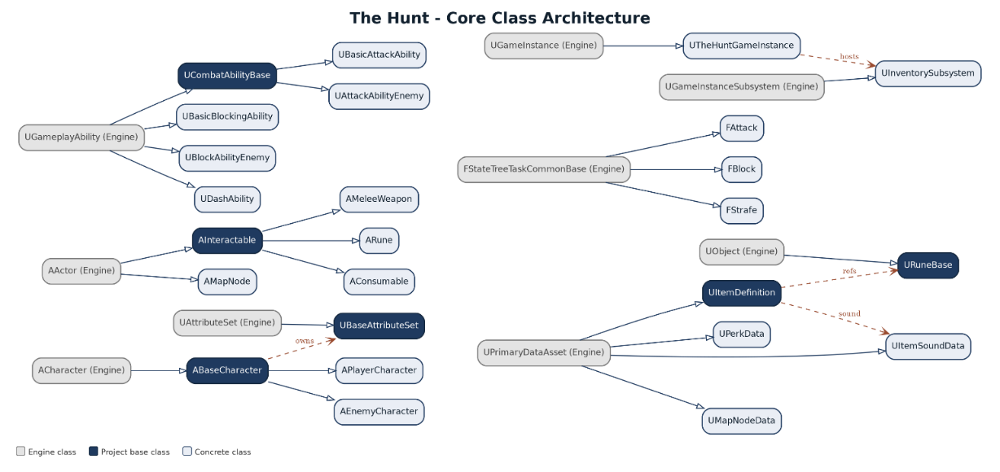](images/image4.png)
*Figure : System Architecture Graph*

## 4.3 Development Roadmap and Planning

At the start of the minor, I created a task list and development roadmap laying out the tasks I expected to complete, the phases I had divided the minor into, and time estimates for each (see Appendix A). I tracked the work on a Hack'n'Plan board organised into weekly goals.

The planning evolved significantly. Several tasks — particularly the enemy AI and the inventory rework — took substantially more time than estimated; the AI alone was reworked twice, first from a Behaviour Tree to StateTree, then to improve its combat behaviour. After reconsidering the scope, several planned features were cut. The STS-style map in the final phase also took far longer than expected, as I hadn't anticipated how much functionality it would need. Much of this was driven by still getting to grips with Unreal early on, where time went into learning the engine rather than producing features, leaving less room for the original feature set than I had anticipated.

# 5. Develop

The Develop phase constitutes most of the minor's work. The following subsections document each major system, the decisions made during implementation, the problems encountered, and how they were resolved.

## 5.1 First Quartal – Foundations

## 5.1.1 Player Movement and Interaction

Development started with the basics: getting a player moving using Unreal's Enhanced Input system, with movement and look actions bound through an Input Mapping Context. Once movement felt right, I built a simple interaction system. Pressing E runs a sphere sweep (SweepMultiByChannel) in front of the player on a dedicated interaction trace channel, so only objects set to respond on it are detected. Any actor hit is checked to see whether it derives from AInteractable, and if so, its OnInteract is called with the player as the interactor. At this early stage, interaction simply destroyed the object, but the structure mattered more than the behaviour.

That structure is the AInteractable pattern: a shared base class every interactable derives from, exposing a single entry point the player calls without knowing the specific object type. That decision paid off as the project grew — every pickup, weapon, and rune is an AInteractable defining its own behaviour by overriding OnInteract, with no change to the player. The entire latter item-pickup flow sits directly on top of this first system.

## 5.1.2 Inventory Foundation

With basic interaction working, I laid the foundation of the inventory system: three pieces working together. The UInventoryComponent is an actor component that holds item data and can attach to any character; the UInventorySubsystem registers each inventory and lets other systems look one up by its owning actor without holding a direct reference; and the first version of the inventory UI communicates with the component through events rather than direct references. These three classes are still the backbone of the inventory today, though all of them — especially the UI — were reworked considerably later (see 5.3.3).

Establishing them early meant the rest of the project had a single, consistent way to store and query items, so every later system that touched inventory — the hotbar, item pickups, the rune-slotting UI, and the event nodes that take an item from the player — could be built against the same component and subsystem rather than each inventing its own handling.

[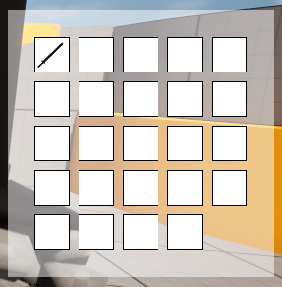](images/image5.png)
*Figure : Inventory with item in it*

## 5.1.3 Items and Item Definitions

Alongside the inventory, I built the data-driven item model. Rather than hardcoding each item as its own class, items are described by UItemDefinition data assets that hold the item's type, icon, description, and, for weapons, the associated weapon data. This meant new items could be created and tuned as data without touching code, and it gave the inventory a single, uniform thing to store and pass around, regardless of whether an item was a weapon, a consumable, or, later, a rune.

[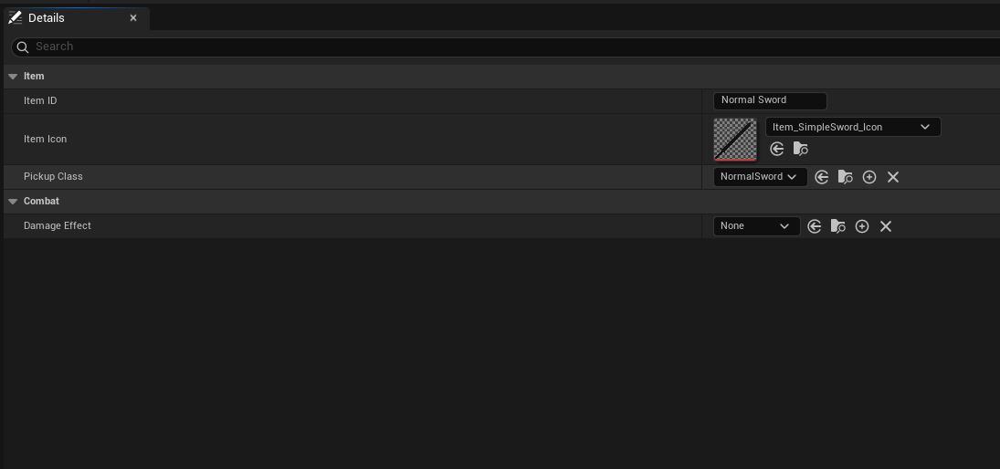](images/image6.png)
*Figure : Image of an Item Definition for a sword*

## 5.1.4 First QA Session

The first QA session involved two programmers: Jasper Nijkam, a fellow student, and Igli Milaqi, an experienced game developer. Their feedback shaped both the technical direction of the early systems and the overall scope of the project.

A practical technical issue Jasper raised was that the sphere trace used for interaction was detecting unintended objects — overlapping primitives that shouldn't have counted as interactables were being picked up by the sweep. The fix I applied was to separate collisions by channel rather than by object type: interaction (and later combat hits) run on a dedicated trace channel, so only objects explicitly set to respond on it are detected, and everything else is ignored at the collision level rather than filtered out in code afterwards. This made interaction reliable and is still the approach the project uses.

Igli raised two structural points. The first was the volume of #includes in C++ headers, which increases compile times and couples files unnecessarily; the fix was to use forward declarations, and move includes into the .cpp files, keeping headers lean. The second was that the player class mixed movement logic with other responsibilities; his recommendation to separate movement into its own component influenced how I structured later systems.

The most significant feedback was about scope. Both reviewers independently flagged that the project risked being too ambitious for the time available — Jasper on the overall game scope, and Igli that I should focus on one vertical slice at a time and prove each system before adding the next. Acting on this, I substantially reduced the scope: one to two enemy types, around three explorable areas, and cutting the planned day/night cycle entirely. This was an important early correction, refocusing development on delivering a smaller set of systems to a finished standard.

## 5.1.5 Challenges

The biggest challenge of this first quarter was not any single system but the learning curve of working in Unreal with C++ for the first time. Before any gameplay could be built, I had to understand the engine's fundamentals — what an Actor is, how Components attach to give actors behaviour and data, and how that shapes a game's structure — and much of the early time went into this groundwork rather than visible features. Specific concepts each took time too: how Enhanced Input maps keys to movement, and how collision channels let objects block, overlap, or ignore one another, which fed directly into the interaction-trace fix raised in QA. The harder, open-ended challenge was structuring everything to scale — deciding what belonged in a base class, what should be a component, and how systems should communicate without becoming tangled. I didn't always get this right early, and some foundations were reworked later, but thinking about structure from the start is what kept the architecture holding together as it grew.

## 5.2 Second Quartal – Enemy AI and Combat Foundations

## 5.2.1 Hand-Coded Enemy State Machine

With the foundations in place, I moved on to the enemy. The first AI was a hand-coded state machine driving the enemy through an EEnemyState enum (Patrol, Alert, Chase, Attack) inside a custom EnemyAIController, using Unreal's UAIPerceptionComponent for a sight sense. A successful perception stimulus switches the enemy to Alert and stops movement; a one-second timer then re-checks whether the player is still perceived before committing to Chase, filtering out single-frame sight blips. In Chase, the controller computes a standoff point along the enemy-player vector and moves toward it, switching to Attack near AttackRange. The Attack state ran a secondary combat state (Strafe, Attacking, Blocking), with strafe using two side-line traces to avoid walls while holding a target range.

This version worked, but because the logic was hand-written and tightly wound together, it was rigid and awkward to extend — which is why it was later rebuilt on a proper framework (see 5.3.1). It was still valuable as a first pass, letting me work out what the enemy should do before worrying about structure.

[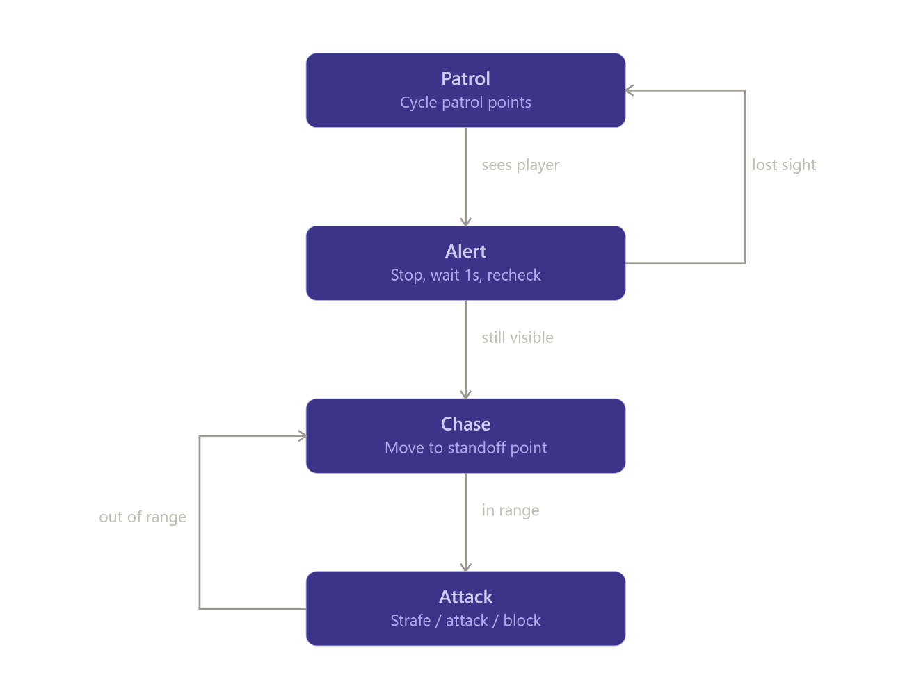](images/image7.png)
*Figure : Image of architecture of the hard coded state machine*

## 5.2.2 Combat Foundations: Attributes, Attacking, Blocking, and Stagger

Next, I built the actual fighting. Both the player and enemy were given health and stamina, and made to take damage when hit. I implemented attack and block abilities through the Gameplay Ability System. Blocking fed into a stagger system: when a blocking enemy is struck, a stagger value builds up, and once it reaches its maximum, the enemy is stunned for 1.5 seconds, creating an opening for the player, same for the player. I then added a death animation and death handling for the enemy so a fight could actually be won. Building the attack and block mechanics on the shared base meant the same combat logic applied to both the player and the enemy, rather than duplicating it.

[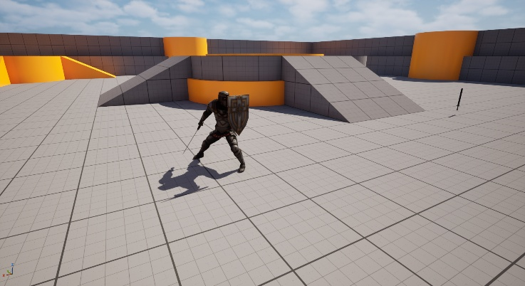](images/image8.jpeg)
*Figure : Image of enemy attacking*

[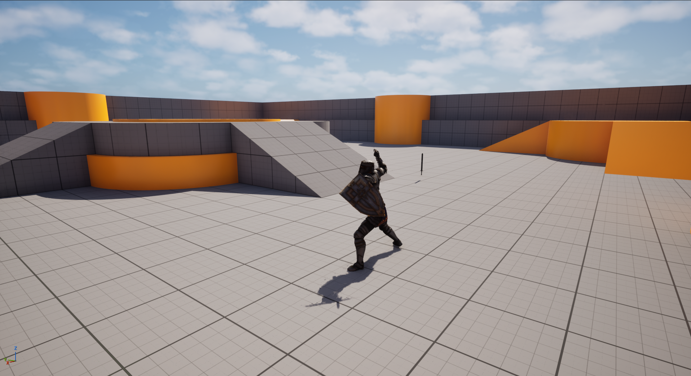](images/image9.png)
*Figure : Image of enemy attacking*

## 5.2.3 Inverse Kinematics Weapon System

One of the largest investments of this quarter did not make it into the final game. I built a full inverse-kinematics system for the player's hands, targeting specific bones on a weapon so weapons could be swapped and animated using only weapon position, rather than authoring full-body animations per weapon. The goal was to make adding new weapons cheap.

I tried several different ways to do it. At first, I approached it through code, but after some research, I found that inverse kinematics in Unreal is usually handled from within the animation blueprint of the thing you want to animate (an animation blueprint is the asset that controls how a character's skeleton moves and blends between animations at runtime). I used a Two-Bone IK node there to connect the hands to the weapon's set bones.

It worked, but it took a significant amount of time, and following feedback, it was scrapped in favour of per-weapon animation, which gave better-looking results for our scope. Although the work was cut, it was a useful lesson in weighing the cost of a clever, general system against simpler approaches that fit the project better - a judgement that influenced later decisions.

[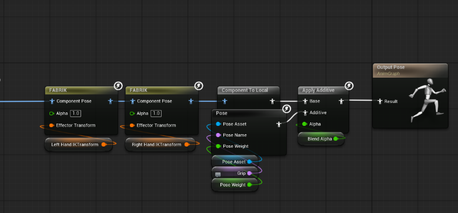](images/image10.png)
*Figure : Image of the Player's hands holding a weapon with IK*

[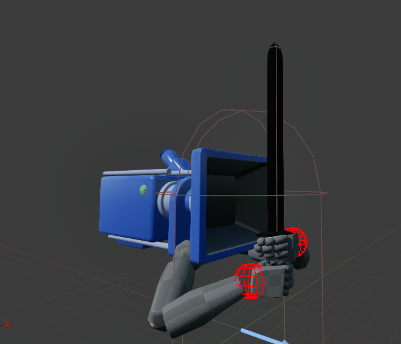](images/image11.png)
*Figure : Image of the Player's hands holding a weapon with IK*

## 5.2.4 Combat Feedback, Dash and HUD

To make combat more readable, I added a visual effect when the player takes damage, providing clear feedback when they are hit. I implemented a dash ability in GAS that moves the player in the direction they are facing, providing an evasive option. I also built the HUD for the player's health, stamina, and stagger, along with a health bar above the enemy, so all the combat values I had just implemented were actually visible to the player. In Unreal, on-screen interfaces like these are built from widgets - the building blocks of any UI, such as text, images, bars, and buttons. Widgets are arranged within a Widget Blueprint, which defines both the interface's appearance and behaviour. To make the HUD reflect what was happening in the game, I bound each element to the underlying combat values, so that when a value like health or stamina changed in code, the corresponding bar on screen updated automatically.

[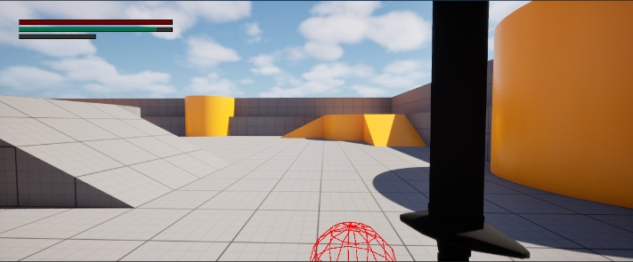](images/image12.jpeg)
*Figure : The HUD when the player takes damage*

[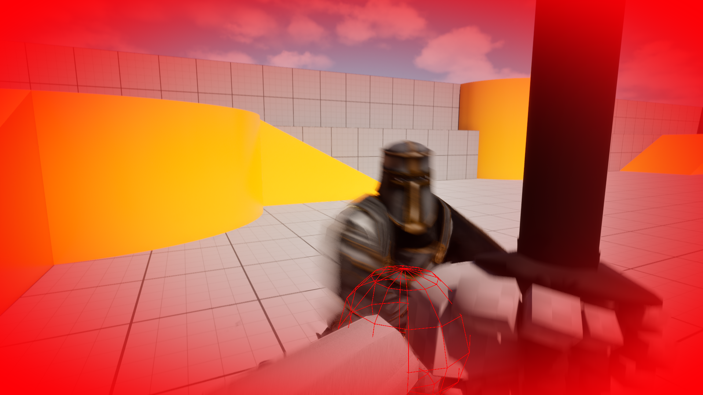](images/image13.png)
*Figure : The HUD when the player takes damage*

## 5.2.5 Second QA Session

The second QA session focused on how combat felt to play, with feedback from my supervisor and a teammate falling into a few clear themes.

On the IK weapon system, Daniel raised that the workflow would cause problems down the line, suggesting the animation be rebuilt in Blender, so it comes from the hands rather than being derived from the weapon — feedback that ultimately led to the IK system being replaced with per-weapon animation. Igli noted a related issue: the IK grip points were hardcoded positions rather than bone sockets, making weapon swapping fragile; this was fixed by moving the grip points to named sockets on the weapon mesh.

On the AI, the hand-coded state machine was flagged as something that would become hard to scale, with the recommendation to move to Unreal's StateTree. Testers also felt the AI's transitions were abrupt — with no cooldown between actions, it came across as twitchy — which was improved by adding per-state cooldown timers and a brief idle pause.

Feedback also touched on code structure and reliability: stagger and blocking logic mixed in one place was separated into a dedicated combat component; the sword collider was identified as poorly fitted, hurting hit detection; and the use of raw pointers was raised as a memory-safety risk, with a plan to refactor toward TObjectPtr and TWeakObjectPtr.

Taken together, this session shaped much of the second half of the quarter — most notably scrapping the IK system and moving to a more maintainable AI approach.

## 5.2.6 Challenges

The biggest challenge this quarter was getting the inverse-kinematics system to work. It took a great deal of trial and error to understand how IK is handled in Unreal, and despite the effort, it ultimately didn't make it into the final game — though it was a valuable lesson in weighing a clever general system against simpler approaches.

Getting used to GAS was also challenging. It is powerful but has a steep learning curve: attributes, abilities, effects, and tags must fit together correctly, and a small mistake in one place can stop the whole system from functioning. Finally, learning to create UI and drive it from live gameplay values was unfamiliar territory at the start of the quarter.

## 5.3 Third Quartal – Major Reworks

## 5.3.1 Enemy AI Rebuilt on StateTree

The biggest task of this quarter was rebuilding the enemy AI. The hand-coded state machine from 5.2.1 was replaced with one built on Unreal's StateTree, a visual framework where states and their transitions are laid out as a tree rather than written in code. Dedicated evaluators read perception, distance to the player, and combat stats like attack cost, health, stamina, and stagger, feeding those into the transitions so the behaviour logic never queries the world directly.

The enemy starts in Idle, then Patrol, walking its surroundings until it detects the player. It moves to Investigate, pausing briefly to verify the player is still there, before committing to Combat — the most complex state. It first runs Chase Player to close the distance, then continuously evaluates: Attack if it has the stamina and health, Strafe to reposition while stamina regenerates, or Block if its stamina and health are too low. A separate Staggered state takes over when the stagger meter fills, briefly stunning it — the player's reward for breaking its guard.

The new version was far more reactive. The hardest part was not making the AI capable but making it feel fair, since an enemy that attacks too often or tracks too precisely breaks the Soulslike feel. To address this, I added attack-commitment windows, recovery delays, and distance-based attack selection, giving the player consistent, readable windows to respond.

[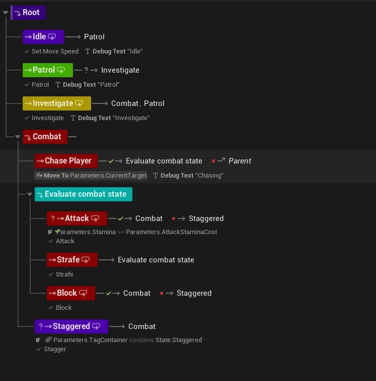](images/image14.png)
*Figure : Enemy StateTree*

## 5.3.2 Weapon Runes

I added the rune system, which lets weapons be modified by slotting in runes. Each weapon holds 3 rune slots, and a rune fires its effect at the moment the weapon connects with a target. The first, and only rune I built, as a proof of concept, was an on-hit poison rune, which applies a damage-over-time effect to whatever it hits. Because runes hook into the existing hit-detection point on the weapon, making the effect is as simple as defining a new combat effect using GAS, and adding new rune effects later is largely a matter of defining what happens on hit, without changing the combat itself.

[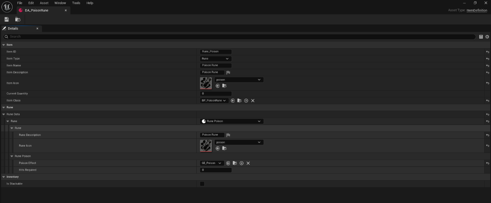](images/image15.png)
*Figure : Item definition of poison rune*

## 5.3.3 Inventory, Perks and UI Rework

With more systems depending on it, the inventory and its UI were reworked from the early foundation laid in 4.1.2. The UI was rebuilt to be clearer and more informative, including a hover panel that displays an item's description and stats. This panel is currently a proof of concept — it demonstrates that item data can be read and shown on demand, and would be expanded given more time.

Previously, every item of the same type pointed to a single shared definition — a data asset describing its stats. Because all copies referenced the same object, modifying one modified them all: slotting a rune into one weapon applied it to every other copy, including those held by enemies. To fix this, I reworked the inventory so each non-stackable item creates and holds its own instance of its definition, keeping changes local to that weapon. Resolving this was essential before runes could work, since the rune system depends on each weapon carrying its own modifications independently.

I also added the ability to drop, rearrange, and equip items directly from their slots. Finally, I worked on perks: like items, each perk is a data asset, containing an icon and a GAS gameplay effect. When applied, the icon is stored in a dedicated perk inventory while the effect is applied directly to the player through GAS. I built a separate inventory for perks to keep them distinct from regular items.

[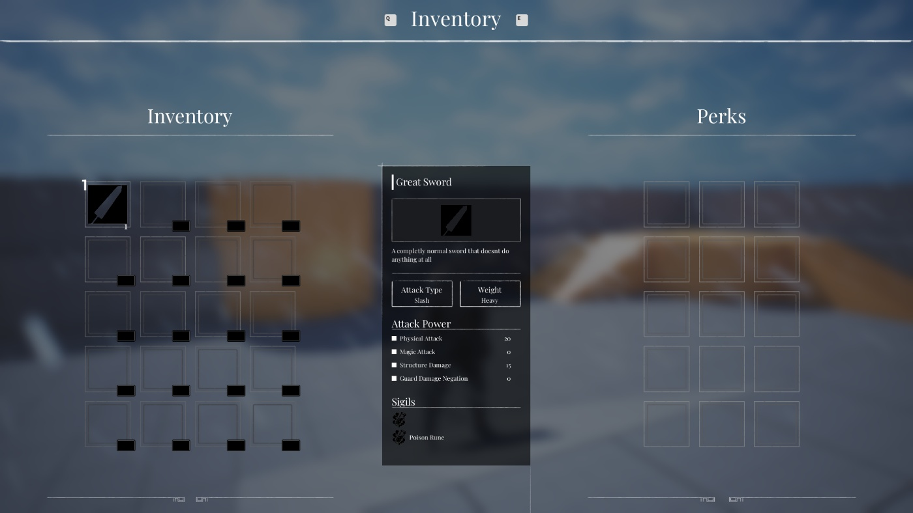](images/image16.jpeg)
*Figure : Refactored Inventory*

## 5.3.4 Third QA Session

The third QA session focused on how impactful and readable the combat felt, with feedback clustering around three areas: combat feel, enemy AI, and audiovisual feedback.

On combat feel, the main note was that attack animations felt disconnected from the moment of impact, with a suggestion to add hitstop or camera shake. In response, I added two camera shake profiles through GAS Gameplay Cues — an intense one when the player is hit, and a shorter, punchier one when an enemy is hit. I also implemented hitstop using global time dilation on the weapon actor, but removed it after testing, as it didn't feel good in practice; I'm now considering reworking it as a rune effect instead, time permitting, so the player can choose whether they want it.

On the enemy AI, the tester asked for a parry window and for the player to be invulnerable during a dash. Both were addressed: I added a Parryable state to the enemy attack animation, giving a clear window to parry, and I disabled the player's hitbox from the animation blueprint during a dash.

The final area was visual and audio feedback. I added per-enemy Niagara hit particles through Gameplay Cues, with block and parry contacts spawning distinct spark VFX, and added per-weapon sound pools for hit, swing, block, and parry, each picking a random sound on play. Overall, this session was less about fixing broken systems and more about polish.

## 5.3.5 Challenges

This quarter's challenges were spread across several large systems. The most involved was the rune system, where the core difficulty was a subtle bug caused by items of the same type sharing a single data definition — meaning a rune slotted into one weapon would affect every copy of it. Tracking this down and reworking the inventory so each item carried its own instance took significant investigation before runes worked correctly per-weapon.

Learning how StateTrees work in Unreal was also a challenge — understanding how states, transitions, and evaluators fit together, how to debug them, and how to get game data into the tree's decision-making took time to get right. Building the perk system and redoing the entire inventory added further complexity, as both had to be rebuilt almost from the ground up and made to work together cleanly.

## 5.4 Fourth Quartal – Map, Events, and Polishing

## 5.4.1 Third-Person Player Rework

A major change this quarter was reworking the player from first-person to third-person — a deliberate shift to bring the game closer to its Soulslike reference points, where seeing your own character and a locked-on target is central to how combat reads. The change touched nearly every part of the player.

Animation and Camera

The first thing to go was the inverse-kinematics hand system. In first-person, it had driven the hands onto the weapon, but in third-person, the animation needed to come from the character itself, so I removed the IK setup and made the player's animations fully character-driven. The camera was rebuilt onto a spring arm — a component that holds the camera at a set distance behind the character and handles collision smoothly — which made the lock-on camera possible, keeping a targeted enemy in frame while the player circles. The dash was also reworked to fit the new perspective.

Combo System

I set up the attack animations to support combos. Each carries two notifies, "open combo window" and "close combo window" (notifies are markers on an animation that fire events at specific moments). If the player clicks within that window, the input is stored, and when the window closes, the character continues into the next attack. This input buffering gives combat a responsive, chainable feel rather than locking the player into isolated swings.

Directional Hit Reactions

Finally, I added a function to detect which direction the player is hit from, so the matching reaction animation plays for a front, back, or side hit — making incoming damage clearer and reinforcing the Soulslike feel.

## 5.4.2 Per-Weapon Animation Data

To make adding new weapons easy, I extended the weapon's item definition so that each weapon carries its own animations. Creating a new weapon is now simple: create the item definition, set the mesh, assign the animations, and it's ready — no further code required. This keeps the cost of adding content low, which was one of the original goals behind the earlier IK experiment, now achieved through a simpler approach.

## 5.4.3 Procedural STS Map

I built the roguelike board generator that produces the between-combat map, in the style of Slay the Spire. Rather than hand-placing nodes, the entire layout is generated each run procedurally, so the path differs every time. The generator runs in several stages.

Scattering the nodes. The first stage uses Poisson-disk sampling, which scatters points randomly but with a guaranteed minimum distance between them, so the nodes feel naturally spread out rather than clumping or landing in a grid.

[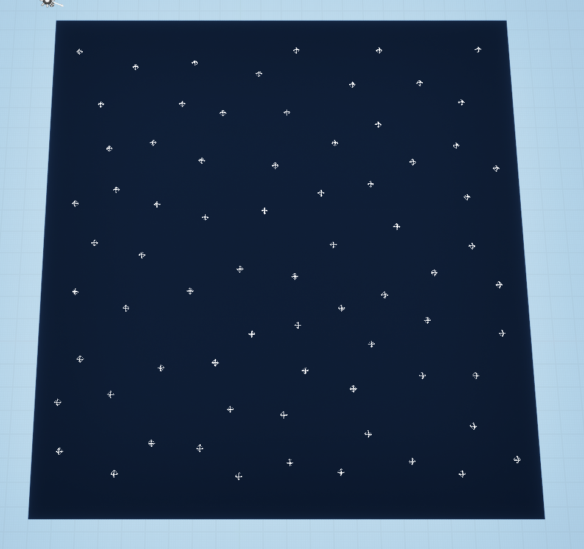](images/image17.png)
*Figure : Poisson disk sampling*

Working out connections. Delaunay triangulation is then run over those points, working out which nodes are near enough to sensibly connect and producing a web of candidate links without awkward overlapping connections.

[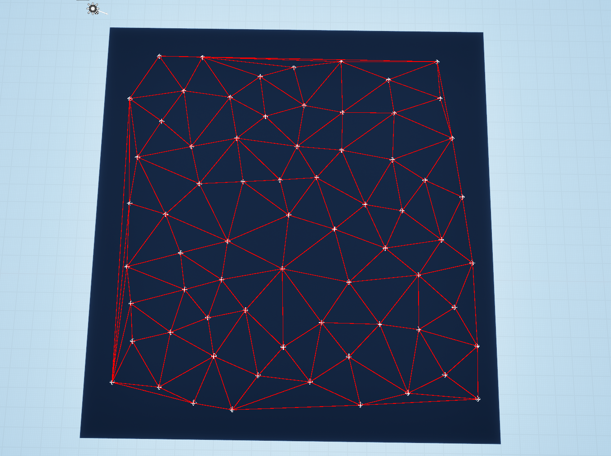](images/image18.png)
*Figure :Delaunay triangulation on sampled nodes*

Carving the routes. From that web, a multi-path A* search carves several distinct routes from the bottom of the map to the top. Running A* multiple times produces several paths, deliberately allowed to share some junction nodes — these shared junctions are what give the player meaningful choices, as a route might split, rejoin another, and split again.

[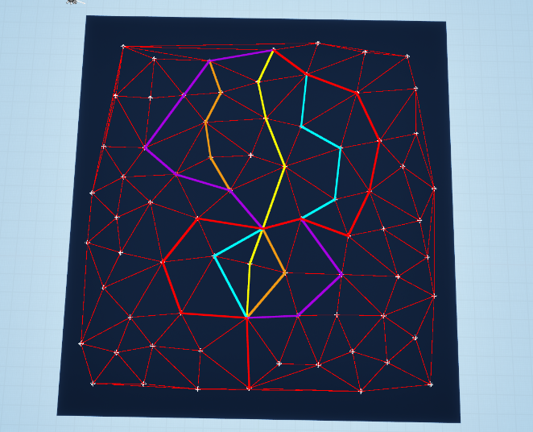](images/image19.png)

[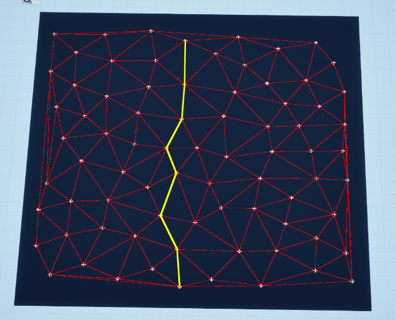](images/image20.png)

Assigning node types. Each node is then assigned a type — combat, rest, rune, random encounter — spaced along each path so encounters are distributed at a steady rhythm rather than clustering.

Finally, the generated layout and the player's position on it persist across level loads, so leaving the map to fight and returning leaves the board and progress exactly as they were.

*Figure : Final version of the STS-Map*

## 5.4.4 Progression and Saving

A significant part of this quarter went into the progression and save system, which keeps the player's state consistent as they move between the map and combat levels. Each time the player transitions between worlds, their progression, attributes, equipped weapon and its runes, inventory, and perks are gathered into a single data structure, stored, and then read back and applied when the new level loads, so nothing is lost in the transition.

Much of the difficulty came from making sure the right data survived the move: runtime objects that only exist while a level is loaded are destroyed when the player travels, so anything that needs to persist has to be stored as data that can be safely carried across, a distinction that caused several subtle bugs before the system was reliable.

Because the progression is already stored in a single serializable structure, the system can extend cleanly to full save-and-load between play sessions, writing that data to disk rather than holding it only in memory. For the current scope, saving is handled only between worlds within a single session, which is all the game needs for now.

## 5.4.5 Map Events

On top of the map, I built the node event system. When the player reaches an event node, an event triggers, and each event type is defined as data: a reward pool, the conditions, and which UI to show. This shared pattern means events are not bespoke. The three types are a tool-usage event (the player offers an item to get a reward), a stranger trade, and a push-your-luck event, each with its own UI but the same underlying data-driven structure.

## 5.4.6 Sound and VFX

I added the audio and visual polish. Each weapon carries its own set of combat sounds (swing, block, parry). Footsteps are animation-based: notifies placed on the walk and run animations fire at the moment each foot lands, triggering a line trace that detects the surface underfoot and plays layered, randomised footstep sounds for variety. I also added sound effects to the dodge roll, driven by notifies on the roll animation, so the audio stays in sync with the movement. Alongside this, I added visual effects across combat and the environment to make the world feel more alive.

## 5.4.7 Final QA Session

The final QA session was a broader review of the project as a whole rather than a list of fixes, carried out with Daniel. Earlier in the quarter, I had struggled to debug the StateTree, and a useful part of the session was being shown how to debug it more easily, which made tracking down AI behaviour issues far less painful.

Daniel also reviewed my Blueprints and found them well structured. His overall feedback was positive: given the time available and that I had started the minor with no prior knowledge of Unreal Engine, he felt I had accomplished a lot and done it well, making use of a wide range of the engine's features and learning a significant amount.

He also noted that using both Blueprints and C++ is a strength, and that the way I had split them was sound — relying mainly on C++ for large core features and Blueprints for quick prototyping and UI. It was good to have that division validated.

## 5.4.8 Challenges

The challenges this quarter were tied to the breadth of systems built and keeping them working together. Reworking the player from first-person to third-person touched animation, camera, combat, and weapon data, and getting all of it to fit the new perspective cleanly took considerable effort.

The map generator was challenging in a different way, requiring several unfamiliar algorithms — Poisson-disk sampling, Delaunay triangulation, and multi-path A* — to be combined into one pipeline that produced playable layouts, then iterated until the results felt good rather than just technically correct.

The progression and save system was also demanding, largely because runtime objects are destroyed when the player travels between levels, which caused several hard-to-find bugs before the right data reliably persisted. Finally, debugging the StateTree was a recurring difficulty, and it wasn't until the final QA session that I learned to do it effectively.

# 6. Deliver

## 6.1 Video and Build

The main deliverable is a demo showcase video/trailer of the game, showcasing the core vertical slice: the Slay the Spire-style map, combat, explorable areas, and the overall mechanics tied together. This serves as the clearest single overview of what was built.

A playable build of the game is also included in the folder. The full project is additionally available on my GitHub page. The build was tested for bugs, and the core systems appeared to work as intended, though given the project's scope, it's likely that some issues were missed and a few bugs remain.

## 6.2 Reflection

This phase turned out more demanding than a wrap-up phase might suggest. While much of the work was, in principle, the usual steps before a presentation and bringing the final evaluation deck up to date, the build itself caused real problems. Packaging surfaced several issues — some that only appeared in a packaged build rather than the editor, and others that were simply bugs I had missed through not testing thoroughly enough. Because of the project's scope, I only caught several of them two days before the deadline, leaving a narrow and stressful window to address them. I worked through as many as I could, but given how late they surfaced, I'm not fully certain I fixed them all. It reinforced a recurring lesson: packaged builds behave differently from the editor, and not testing enough — and leaving it until late — is risky.

Preparing the presentation, by contrast, went smoothly. Having given three preparational presentations beforehand, I already had a clear idea of what to show and a solid base to build on, so final prep was largely a matter of incorporating feedback and keeping up what was already working.

# 7. Final Reflection and Conclusion

## 7.1 Planning

The goal each week was to hit roughly 36 working hours, and while that was always what I aimed for, it wasn't always easy to reach. Depending on which tasks were left, how complicated they turned out to be, and what else was going on alongside the minor, the hours I actually put in would vary — some weeks I went over, others I fell short. Whenever that happened, I made sure to adjust the following weeks accordingly, sometimes doing extra work on weekends or during breaks to catch up on anything left unfinished, so that the product would still reach the state I wanted by the end.

Differences between planned and actual hours were common. Some tasks I expected to be simple turned out to be far more work — the enemy AI, estimated at around 30 hours, took well over 100 across two rewrites, and the inventory rework similarly overran. Whenever this happened, I adjusted the planning to fit everything back into the timeframe.

Overall, though a bit rough at times, I'd say my planning was acceptable and largely successful. The estimates held up well in terms of what to build, even if they were sometimes badly off on how long things would take, which isn't surprising given that most of these were features I'd never built before. Where the planning genuinely helped was keeping the scope coherent: even when individual systems ran over, I always had a clear picture of which features were essential to the vertical slice and which could be cut or left in progress. For future projects, the main thing I'd change is to build more slack into the estimates for anything involving an engine feature I haven't used before, and to treat "make it feel good" as its own significant task rather than folding it into the implementation time.

## 7.2 The Final Product

The vertical slice came together around a set of core mechanics - combat, enemy AI, the procedural map, the inventory, runes, and the event system. These were the main systems I focused on building out over the project. From the outside, the result might look modest, and one could reasonably ask why so much time was spent on what's visible. The answer is that much of the work lies beneath the surface.

Much of the effort went into systems that don't appear directly on-screen but make everything else possible: the GAS integration behind health, stamina, stagger, abilities, and the different tag-handled systems; the data-driven weapon and item definitions; the Game Instance-backed progression that carries the player's state between worlds. These took significant time to set up properly, but once in place, they made adding content far cheaper — a new weapon, for instance, became a matter of creating a data asset and assigning its mesh and animations.

Bug fixing was the other constant, and problems with engine features I had no prior experience in regularly cost more time than expected. The final stretch added more of this, as packaging the build surfaced issues that hadn't appeared in the editor, several of which I only caught two days before the deadline.

Overall, though, I'm happy with what I've accomplished and proud of how far I've come. It still has its flaws and bugs, but this isn't something I plan to leave as it is - I intend to keep working on it, fix the issues it still has, and polish it further over time.

## 7.4 What I Would Do Differently

Two things stand out beyond the time estimates. First, I'd invest more in the Define phase, specifically the enemy AI. Building it twice cost me a lot of time, and a proper research spike up front, including studying reference games from an AI perspective rather than just a player's, would likely have saved most of that time. Second, I'd define the C++/Blueprint boundary clearly from the start. The split that worked best was C++ for data structures, interfaces, and core logic, and Blueprint for presentation and configuration, but in the early weeks, some logic drifted into Blueprint and later had to be pulled back into C++, creating refactoring overhead that compounded over time.

Beyond those, I would also scope the project even more conservatively than I did. The scope itself was reasonable, and had everything gone smoothly, I'd likely have accomplished a little more than I ended up with — but some things were outside my control. The project became corrupted twice, and each time I lost several days of progress. Building in more of a buffer for setbacks like that would have left me less exposed when they happened.

## 7.5 Final Words

This project was rich in experience and learning. I came in curious about what it takes to build an ambitious game system from the ground up, and over the semester that became far clearer. The Hunt is technically ambitious for a minor, and I'm satisfied with how far it has come — but more than any single feature, what I'm most satisfied with is the quality of the decisions behind it. Choosing GAS, choosing StateTree, designing the character hierarchy the way I did — none of these was obvious, and each came from researching the options, weighing alternatives, and committing. Some turned out wrong and had to be redone, but even those taught me where my judgment was still weak.

This isn't a project I plan to leave as it is. A few features were left in progress at submission, and there's polish I had to set aside for time's sake that I'd like to return to. Having enjoyed the work and seen what it produced, I expect to keep building on it when I find the time and motivation. For now, though, I'd call my Minor Skilled a success and finish this report by saying: Let The Hunt begin.

# 8. Asset Credits

The following third-party assets were used in the development of The Hunt. All assets are used in accordance with their respective licences for educational and non-commercial purposes.

8.1 Animations and Character Models

All player animations and models were taken from this open-source GitHub repository: https://github.com/georgehuan1994/Unreal-Melee-Combat-System

Enemy model and animations were taken from Mixamo — Pro Sword and Shield Pack: https://www.mixamo.com/

8.2 Audio

Sound effects were sourced from Cyberwave Orchestra (https://www.patreon.com/cw/cyberwave). Individual sounds used:

https://www.patreon.com/cyberwave/posts/ultimate-fantasy-153743779?collection=1484382
https://www.patreon.com/cyberwave/posts/whoosh-melee-127341406?collection=1484382
https://www.patreon.com/cyberwave/posts/sword-sound-v8-133088816?collection=1484382
https://www.patreon.com/cyberwave/posts/savage-steel-127709625?collection=1484382

https://www.patreon.com/cyberwave/posts/rpg-game-sound-127630282?collection=1484382
https://www.patreon.com/cyberwave/posts/bloodbath-blood-127061197?collection=1484382

8.3 Visual Effects

Niagara VFX systems were sourced from the Unreal Engine Marketplace (Fab):

https://www.fab.com/listings/d2136c01-8d35-403f-a637-146e8173bdb3

https://www.fab.com/listings/bd2ba790-7266-49f3-bb4f-8049f6797c01

https://www.fab.com/listings/2ca20547-df79-4978-ab46-af52ef6e917d

8.4 Icons

– All perk icons and the poison rune icon are AI Generated

8.5 Map Assets

All map assets — the STS map and the two explorable areas — were created by my teammate, Octavian Micu, as were all assets in the project's Content/Assets folder. These were made specifically for this project, and I have full permission to use them.

# 9. References

Design Council. (2005). The double diamond design process model. Design Council.

Epic Games. (n.d.-a). Unreal Engine documentation. https://dev.epicgames.com/documentation/en-us/unreal-engine

Epic Games. (n.d.-b). Gameplay Ability System overview. https://dev.epicgames.com/documentation/en-us/unreal-engine/gameplay-ability-system-overview

Epic Games. (n.d.-c). State Tree overview. https://dev.epicgames.com/documentation/en-us/unreal-engine/state-tree-overview-in-unreal-engine

Lague, S. (2018). Poisson Disc Sampling [Video]. YouTube. https://www.youtube.com/watch?v=7WcmyxyFO7o

Looman, T. (n.d.). Unreal Engine C++ Programming Guide. https://www.tomlooman.com/unreal-engine-cpp-guide/

Mega Crit. (2019). Slay the Spire [Video game]. Mega Crit.

Nystrom, R. (2014). Game Programming Patterns. Genever Benning.

# 10. Appenidx

Appendix A – Development Roadmap (File: Engineer Roadmap.PDF)

Appendix B – Job Research (File: Job Research.PDF)

Appendix C – Images from the game maps (Folder: Game Images)

---

[↑ Back to top](#the-hunt)
